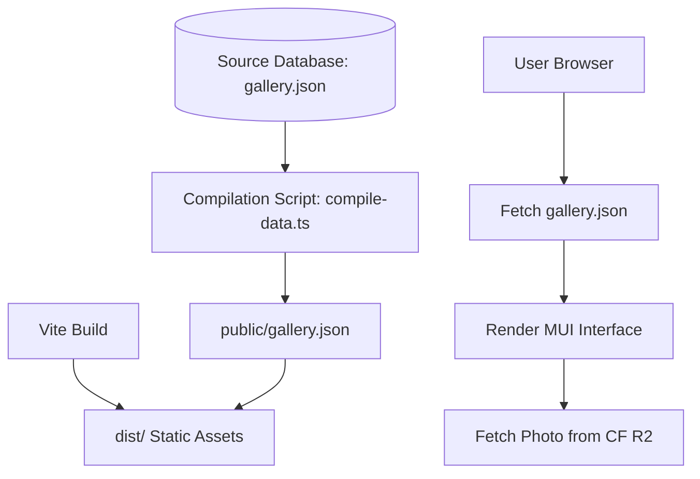

# NicoGallery - Photo Gallery Project

This document outlines the project guidelines, design choices, database schema specification, and development rules for **NicoGallery**.

## Project Stack & Goals
- **Framework**: React (Vite-based) with TypeScript.
- **UI Design System**: Material Design via [Material UI (MUI)](https://mui.com/material-ui/).
- **Deployment**: Static build deployable directly to **GitHub Pages**.
- **Asset Strategy**: No binary images stored in the repo. Images are hosted on Cloudflare R2 and referenced via URLs.
- **Data Source**: A pre-compiled JSON file containing image details and EXIF metadata, parsed from a source database during compilation.

---

## Architecture & Workflows

### 1. Data & Compilation Flow
The application requires a clean separation of the development database and public static assets:



- **Source Database**: Located at `data/gallery.json` (for ease of direct JSON edits or future SQLite migration).
- **Compilation Step**: A build-time Node/TypeScript script validates, parses, and cleans the source database, writing a minified `gallery.json` to the `public/` folder.
- **Runtime Step**: React fetches `/gallery.json` at startup, ensuring that the client only loads JSON schema objects without embedding heavy image binaries in the bundle.

### 2. File Structure Proposal
```
NicoGallery/
├── data/
│   └── gallery.json           # Raw source gallery data
├── scripts/
│   └── compile-data.ts        # Script to process data/gallery.json -> public/data.json
├── public/
│   └── data.json              # Compiled/cleaned gallery data (gitignored or committed depending on deploy)
├── src/
│   ├── assets/                # Local UI icons/logos
│   ├── components/            # UI components (Gallery Grid, Photo Details, Exif Card, etc.)
│   ├── theme/                 # MUI custom theme configurations
│   ├── App.tsx
│   ├── main.tsx
│   └── types.ts               # Shared TypeScript types for gallery and EXIF data
├── docs/
│   └── database_design.md     # Normalized Database Design Documentation
├── GEMINI.md                  # This rules & decisions document
├── vite.config.ts
└── package.json
```

---

## Important Rules & Decisions
1. **Material Design Aesthetics**:
   - Conforms strictly to Material Design 3 guidelines.
   - Use dynamic colors/themes, responsive layouts (masonry grid or standard grid), transitions, and deep focus on visual presentation.
   - Provide dark/light mode toggle with a premium feel.
2. **GitHub Pages Constraints**:
   - The build output must be fully static.
   - SPA routing (if any) must handle GitHub Pages subfolder hosting (`/NicoGallery/` if hosted at `<username>.github.io/NicoGallery/`).
   - Bundle size optimizations (tree shaking for MUI, image lazy loading).
3. **Database Rules**:
   - The source database schema must capture full EXIF details (Camera, Lens, Focal Length, Aperture, Shutter Speed, ISO, Software, Shot Date/Time, Location) and gallery categorization (Tags, Albums, Collections).
4. **Git Commit Strategy**:
   - Commit code changes iteratively to show progress.

---

## Future Phase (TODO)
- A management tool (CLI or Web Dashboard) to import photos, automatically extract EXIF metadata using standard libraries, upload original & optimized WebP images to Cloudflare R2, and write metadata to the source database.
