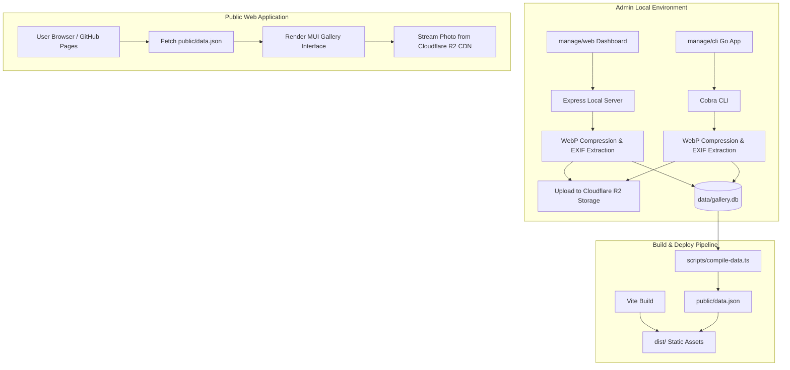

# Gallery 📷

🚀 **Fully Built by Gemini**

A modern, fast, and elegant personal photo gallery web application designed for static deployment on **GitHub Pages**, paired with a dedicated local management tool ecosystem (**Web Dashboard** & **Go CLI**).

[](https://react.dev)
[](https://vite.dev)
[](https://mui.com)
[](https://www.typescriptlang.org)
[](https://www.sqlite.org)
[](https://go.dev)
[](https://www.cloudflare.com/developer-platform/r2/)
[](#)

---

## ✨ Highlights & Architecture

- **Frontend Gallery**: React + TypeScript + Vite, styled using **Material Design 3 (MUI v9)** with dark/light mode, smooth animations, blurred AppBars, responsive masonry grid, and EXIF parameters modal.
- **Image Storage Strategy**: Zero binary images in repository. Images are compressed into WebP, uploaded to **Cloudflare R2**, and referenced via public CDN URLs.
- **Local Data Management**: Managed via a local **SQLite database** (`data/gallery.db`), providing ACID transactions and relational integrity (Photos, Albums, Tags).
- **GitHub Pages SSG Compilation**: During static build (`npm run build`), SQLite data is exported to a minified [`public/data.json`](public/data.json) for zero-backend static hosting on GitHub Pages.



---

## 📁 Repository Structure

```
NicoGallery/
├── data/                      # Local database directory (gallery.db ignored by git)
│   └── .gitkeep
├── manage/                    # Admin management tools ecosystem
│   ├── web/                   # Web Dashboard (Vite + React + MUI + Express Server)
│   └── cli/                   # Command Line Tool (Go + Cobra CLI)
├── public/
│   └── data.json              # Compiled/exported gallery database for GitHub Pages
├── scripts/
│   └── compile-data.ts        # SQLite compilation script -> public/data.json
├── src/                       # Main Gallery Frontend Application
│   ├── components/            # UI Components (PhotoGrid, PhotoDetail, ExifCard, etc.)
│   ├── theme.ts               # Material Design 3 Theme configuration
│   ├── types.ts               # Shared TypeScript interfaces
│   ├── App.tsx
│   └── main.tsx
├── deploy.sh                  # GitHub Pages deployment automation script
├── GEMINI.md                  # Project rules and architectural guidelines
└── README.md                  # Project documentation
```

---

## 🚀 Getting Started

### 1. Main Gallery (Frontend Development)

```bash
# Install root dependencies
npm install

# Run dev server (compiles SQLite data to public/data.json and starts Vite)
npm run dev

# Build production static bundle for GitHub Pages
npm run build
```

---

### 2. Admin Management Tools (`manage/`)

NicoGallery provides two complementary management workflows:

#### Option 1: Web Dashboard (`manage/web`)
Visual dashboard for drag-and-drop uploading, interactive EXIF preview, metadata editing, tag chip manager, and R2 credentials settings.

```bash
cd manage/web
npm install
npm run dev
```
Open [http://localhost:3000](http://localhost:3000) in your browser.

#### Option 2: Go CLI Tool (`manage/cli`)
Automated command-line tool written in Go for quick scriptable photo publishing.

```bash
cd manage/cli

# Build Go CLI binary
go build -o nicogallery-cli .

# Upload a photo
./nicogallery-cli upload /path/to/photo.jpg \
  --title "Cyberpunk Tokyo Rain" \
  --albums "urban-exploration" \
  --tags "tokyo,street,neon" \
  --quality 80

# List photos & albums stored in SQLite database
./nicogallery-cli list
```

---

## 🌐 Deployment

Deploy the compiled static bundle to the target deployment repository (`git@github.com:aimerneige/gallery.aimer.moe.git`):

```bash
chmod +x deploy.sh
./deploy.sh
```

---

## 🔑 Cloudflare R2 Credentials Setup

Set your Cloudflare R2 parameters in `manage/web/.env` or export environment variables for `manage/cli`:

```env
R2_ACCOUNT_ID=your_account_id
R2_ACCESS_KEY_ID=your_access_key_id
R2_SECRET_ACCESS_KEY=your_secret_access_key
R2_BUCKET_NAME=nicogallery
R2_PUBLIC_URL_PREFIX=https://your-custom-domain.com
```

*Note: Binary photo files are strictly uploaded to Cloudflare R2 and never checked into the Git repository.*

---

## 📜 License

MIT License. Designed with ❤️ for photography enthusiasts.
